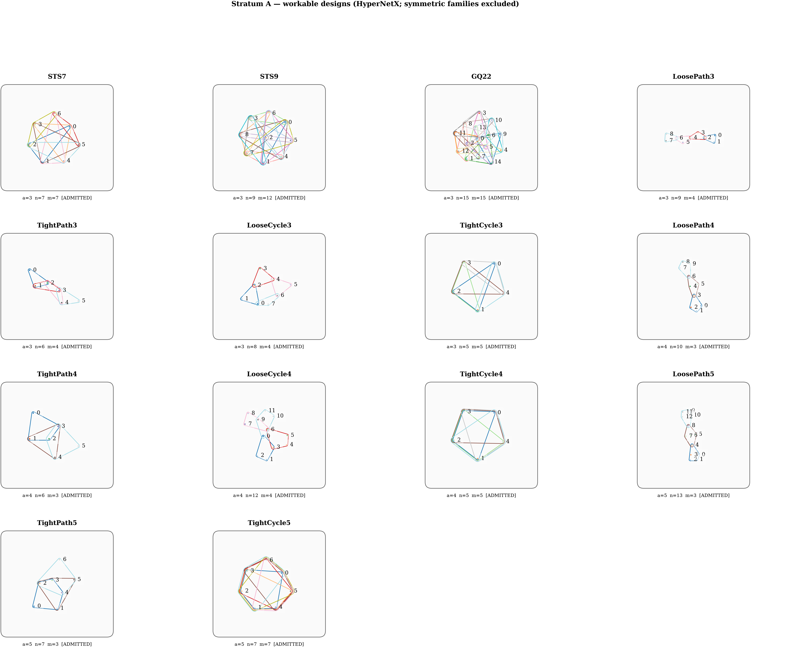
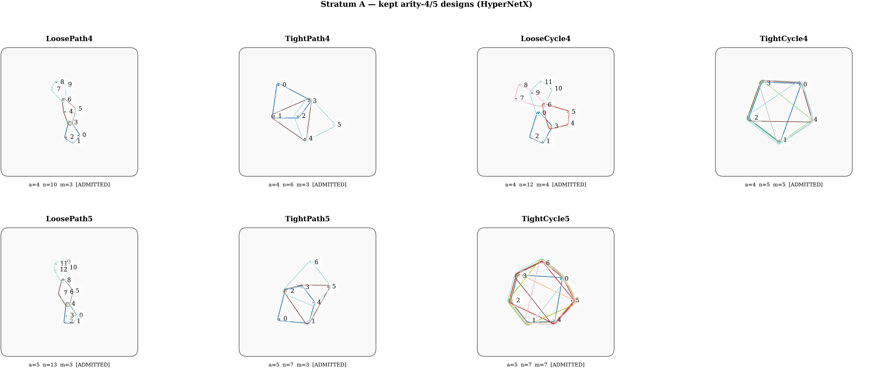
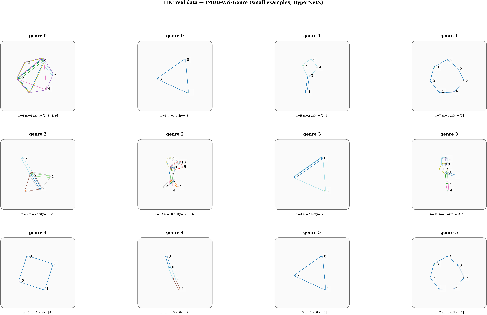
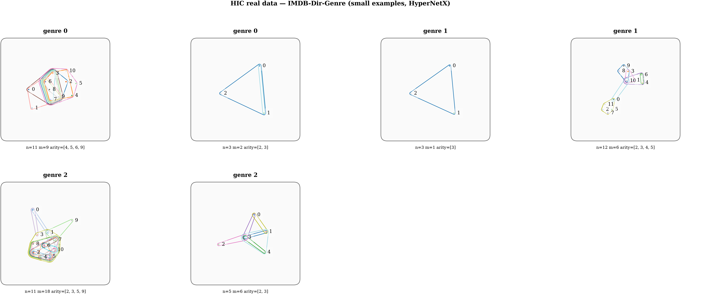
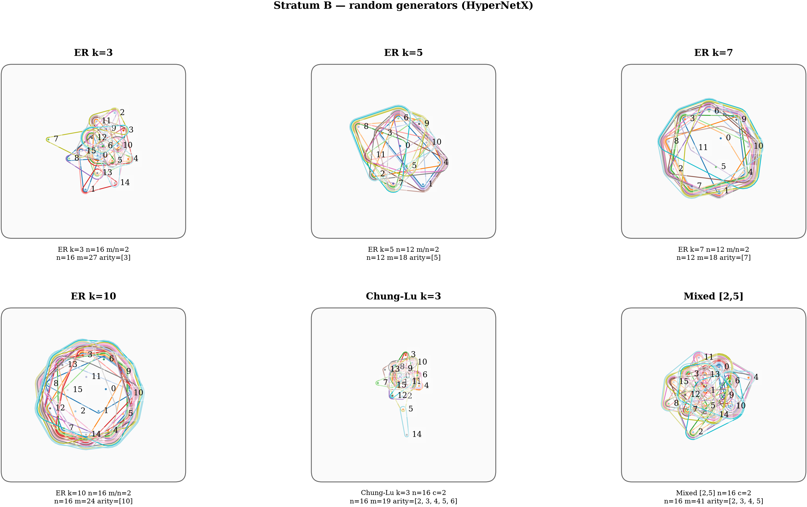

# Data rigor — corpus consistency, coverage, and generalizability

**Status:** planning note (not yet a ledger task). Audit of the corpora actually
used in measured results, against the reviewer question: *are the synthetic
corpora consistent, from known families, and varied enough in synthesis
parameters (n, density, arity) to support generalizable claims?* Ground truth
extracted from the executed configs (`experiments/article/configs/*.yaml`,
`experiments/article/analysis/{mds,bits_harvest,clustering,knn}.py`) and
`docs/article/DATA.md`.

**Verdict up front.** The geometry→applications *body* is internally consistent
(one shared corpus, shared distance caches). But three coverage gaps currently
block a "generalizable results" claim: (1) **near-zero variance in per-hypergraph
synthesis parameters** — every headline number is a single point in (n, m, k,
density) space; (2) **arity ≤ 3 almost everywhere** while the thesis advertises
arity up to k=10; (3) **planted "families" are random seeds, not known designs**,
which also weakens the meaning of ARI-vs-planted-labels. Real data is one
censored domain. These are additions the article needs *before* writing, not
after review.

**S7 pruning resolution (2026-07-23).** The T-M7h feasibility pilot measured all
23 Stratum A candidate families on the Picasso A100 cluster. Nine were dropped and
14 were admitted to the corpus. The pruning resolves **Gap 2 (arity ≤ 3)** in
part: arity-4/5 members are now present (paths and cycles at k=4,5). It also
reveals a new finding — **perturbation-failure** — documented in §2 below and
recorded as a distinct exclusion category in `REVIEW/DATA.md` §2A. The full
admitted catalog and the measurement evidence are in
`artifacts/feasibility_pilot/feasibility_pilot_stratum_a.json`.

---

## 1. Consolidated corpus map (what feeds what)

| Corpus | Feeds | Generation | N | families | n | k (max arity) | seed |
|---|---|---|---|---|---|---|---|
| `planted_n240` | **G1, A1 geometry table, A2, A3, bits** (primary body) | random seeds + Qin perturbations | 240 | 20 | **10 (fixed)** | **3** | 42 |
| `planted_main` | G1 (N=60), A1/A2/A3 (earlier), bits | same | 60 | 5 | 10 (fixed) | 3 | 42 |
| `planted_small` | A1 (HyperCOT only), bits | same | 20 | 4 | 6 (fixed) | 3 | 42 |
| `g2_sensitivity` (sparse/med/dense/designs) | **G2 sensitivity** | perturbation ladders + 4 design fixtures | 750/400/150 edits + designs | — | 6 / 8 / 7 ; designs 7,9,13,15 | 3 / 3 / **4** / 3 | 42,43 |
| `g2_ladder` (small/med/large) | **G2 ladder, A4** | perturbation ladders | 8/8/6 ladders × 10 rungs | — | 5 / 8 / **12** | 3 / 3 / **4** | 42,43 |
| `e1prime_mini_corpus` | **E1′ figure only** | perturbation ladders + exact HGED | 11×630 pairs | — | 5–10 | 3 | 42,43 |
| HIC IMDB (6 genre) | **A1 geometry (ν, D̂), A2, A3** | real IMDB via HIC | 107–1083 | genre classes | real (100s–1000s) | uncapped (w*_c within cap) | — |

**Reading of the map.**
- The body (G1/A1/A2/A3/bits) is *consistent*: all read the same planted
  corpora, and A2/A3 reuse A1's `D.npy` caches (`T-M5b/d_matrix/`). Good.
- G2, A4, E1′ each use their *own* corpora — **necessarily**, because they need
  perturbation ladders with known edit budgets, which the planted corpus does
  not provide. This fragmentation is justified by construction but must be
  stated: there is no single corpus threading geometry → applications →
  discussion, and the per-hypergraph n differs (planted 10; ladders 5/8/12; E1′
  5–10; HIC 100s–1000s).

---

## 2. The three coverage gaps

### Gap 1 — near-zero variance in synthesis parameters (the critical one)

Every item in `planted_n240` is generated at **n=10, k=3, 10 edge-attempts,
3 Qin edits**. The generator does **not** vary n, density, or arity across items
within a corpus; the only structural variation is the 3 arity-preserving edits
around each random seed. Consequently:

- ν = 0.250, D̂ = 26, stress = 0.062, and every A2/A3 score are measured at **one
  point** in (n, m, k, density) space.
- The N = 60 → 480 sweep varies the **number of hypergraphs**, which sharpens the
  D̂ *estimate* — it says **nothing** about how the geometry generalizes across
  hypergraph structure. The paper must not blur these two axes.
- A reviewer's first question — "how do ν, D̂, stress, and the application
  metrics move with n, density, and arity?" — currently has no answer.

**This is arguably co-equal with the missing significance tests.** Significance
testing (`STATS_PASS_PLAN.md`) quantifies uncertainty *at the single point*; a
parameter sweep is what licenses "generalizable." Both are needed; neither
substitutes for the other.

### Gap 2 — arity ≤ 3 almost everywhere

k=3 in every planted corpus, every design fixture (all 3-uniform), the E1′
corpus, and most G2 corpora. k=4 appears in exactly two places (G2 dense
sensitivity, large ladder). **No measured result exists at k ∈ {5,…,10}.** The
thesis advertises "hypergraphs of arity 2 ≤ a ≤ k, k default 10"; the evidence is
(near) 3-uniform. This is also the paper's *own* stated suspect for the 2/7
sensitivity-falsification (arity-preserving k=3 edits cannot trigger the
predicted heavy-tail mechanism), so closing it would also resolve that crack.

**Resolution (S7, T-M7h — partial).** The T-M7h feasibility pilot admitted arity-4
and arity-5 members to Stratum A: four k=4 families (two paths, two cycles) and
three k=5 families (two paths, one cycle). The k=4/5 paths (m=3 edges) serve as
single-instance visual anchors; the k=4/5 cycles are perturbable and participate in
G2/G3. This resolves Gap 2 **for the structured Stratum A** at k ∈ {3,4,5}. Arity
k ∈ {7,10} coverage is delegated to **Stratum B** (the random sweep generator
reaches any uniform or mixed-arity target without symmetry-driven DNF).

**New finding — perturbation-failure in highly symmetric families.** Three
candidate families with large automorphism groups were feasibility-admitted (fast
`w*_c`) but subsequently excluded because **bounded Qin edits exhaust 300 attempts
without producing a non-isomorphic connected member**:

- `complete_k3_n5` (K_5^(3), m=10, Aut = S_5): every Qin edit within budget
  returns to the unique iso-class of the complete 3-uniform hypergraph on 5 vertices.
- `complete_k4_n6` (K_6^(4), m=15, Aut = S_6): 300 attempts exhausted; the orbit
  under S_6 covers all connectivity-preserving Qin neighbors within the budget.
- `complete_k5_n6` (K_6^(5), m=6, Aut = S_6): same mechanism.

The perturbation-failure is a direct consequence of maximally-symmetric structure:
the full symmetric group S_n acting on K_n^(k) produces exactly one iso-class for
every `k`-subset, so bounded edits that remain within the budget cannot escape it.
This mechanism is distinct from feasibility-DNF (which gates `w*_c` computation,
not perturbation). **These three families are not recoverable by increasing the
budget**: the iso-class boundary is at the point where arity-preserving incidence
edits create a non-complete hypergraph, which requires removing an entire
hyperedge — a large-budget edit. The exclusion is principled and final.

*The 14 admitted Stratum A families after the T-M7h feasibility pilot. The three complete hypergraphs (perturbation-failing) and six high-symmetry/large designs (feasibility-DNF) are absent. Arity-4/5 coverage comes from the path and cycle families.*

*Arity-4 and arity-5 admitted families in detail. The m=3 path families (loose_path_k4, tight_path_k4, loose_path_k5, tight_path_k5) serve as visual anchors; the cycles (loose_cycle_k4, tight_cycle_k4, tight_cycle_k5) are the perturbable arity-4/5 members.*

### Gap 3 — planted families are random seeds, not known designs

With `seeds=None` (every executed config), seed motifs are random connected
hypergraphs (rejection sampling), not Steiner systems / projective planes /
generalized quadrangles. The known designs appear only as G2 *measurement
targets*. Two consequences: (a) the paper cannot say its classes are "known
hypergraph families"; (b) ARI/NMI-vs-planted-labels measures recovery of
*random-blob* classes, which is a weaker, less interpretable signal than
recovery of structurally meaningful design families.

**Resolution (S7).** The Stratum A admitted catalog (§2A of `REVIEW/DATA.md`)
replaces random-blob seeds with known combinatorial designs and uniform
paths/cycles. A2/A3 class labels are now structural family types (design, path,
cycle) within a fixed arity — not random seeds. The coarse-class scheme (three
classes at k=3; one non-singleton class at k=4/5) is documented in
`REVIEW/DATA.md` §2A.

---

## 3. Real data — breadth, sufficiency, and proxy assessment

- **Where used:** HIC IMDB carries geometry rows (ν, D̂ on Wri-Genre, Wri-Genre-M)
  *and* the A2/A3 application metrics. So real data is not confined to
  applications — correct any prose that says otherwise.
- **Breadth:** one domain (IMDB via HIC), 6 datasets, of which 2 are "clean"
  (91–92% w*_c yield) and 4 heavily censored (34–43%, censoring correlated with
  labels — the NO-GO from T-DQ3′).
- **Signal:** the clean result is a *negative* (genre near-unclusterable from
  structure for every representation); the kNN hubness story does reproduce.
- **Sufficiency:** **not sufficient** for a strong applied claim. One domain, mostly
  censored, mostly negative. See `REAL_DATA_CORPUS.md` for the remedy (designs
  catalog as a guaranteed-computable anchor + a gate-first low-arity real
  corpus).

**Real-data proxy assessment (S7, measured).** The S7 visualization pass produced
HyperNetX drawings of the HIC IMDB-genre hypergraphs. They reveal the structural
character of real data in this domain:

*HIC IMDB Wri-Genre: genre as hyperedge, movies as vertices. Mixed arity, sparse, small median n, irregular. The heavy censoring (4/6 datasets at 34–43% w*_c yield) is consistent with this structural character — the censored instances are the larger and more complex hypergraphs.*

*HIC IMDB Dir-Genre: genre as hyperedge, directors as vertices. Similar structural profile.*

**Proxy finding.** Real HIC IMDB hypergraphs are characterized by mixed arity,
sparsity (median n ≈ 7–12, tail to ~270), and low structural symmetry. This
structural character is **not** represented by the Stratum A uniform-arity
design-theoretic families, which are vertex-transitive, dense, and
single-arity. The designs are a *complementary* controlled probe — they provide
clean labels, drawable instances, and a symmetric-regime test — but they do not
simulate real-world heterogeneous hypergraphs.

The generator family whose structural output most closely matches real HIC
hypergraphs is the **mixed-arity Stratum B generator** (Erdős–Rényi and Chung–Lu
with `arity ∈ [2, k_max]`, heterogeneous degree distribution). This is the
generator to cite when arguing that the geometry/application results generalize
to real-world hypergraphs. The claim is synthetic-scale; the real-data HIC
exhibit provides a supporting cross-check, not primary evidence.

**Stratum B visualization:**

*Stratum B random hypergraphs: Erdős–Rényi, Chung–Lu, and mixed-arity generator instances. Lower symmetry and more irregular structure than Stratum A designs; more representative of real-world heterogeneous hypergraphs.*

---

## 4. Recommended additions (before writing)

Ranked by importance for a generalizability claim:

1. **Parameter-variation sweep (highest priority).** Add a corpus family that
   sweeps, at minimum:
   - **n** ∈ {10, 20, 30, 50} (does the geometry hold as instances grow?),
   - **density** ∈ {sparse, medium, dense} (edge-attempt count per n),
   - **arity** k ∈ {3, 5, 7, 10} (the advertised range).
   Report ν, D̂, stress, hubness, and at least one application metric (kNN AUC or
   clustering ARI) as a function of each axis. The claim to earn: the geometric
   fingerprint (non-Euclidean, moderate D̂, low distortion, mild hubness) is
   *stable in character* across the sweep, and the application ordering vs
   competitors is *robust*, not a single-point artifact. Note the cost: higher n
   and higher k both push w*_c toward the exponential regime — measure the
   feasible envelope and state it (this doubles as an honest scalability figure).

2. **Seed the planted families from known designs.** Re-seed `planted_n240` (or an
   additional corpus) from the vendored STS catalog + higher-arity designs
   (Steiner S(2,4,v) → arity 4; PG(2,q) lines → arity q+1) so classes are
   structurally meaningful *and* arity > 3 is exercised. This closes Gaps 2 and 3
   at once and makes ARI/NMI interpretable. `PlantedFamilyDataset` already accepts
   an explicit `seeds` argument — this is a config change plus a labeled seed
   loader, not a generator rewrite.

3. **Broaden real data** per `REAL_DATA_CORPUS.md`: the designs catalog (guaranteed
   computable) + one gate-first low-arity real-world corpus, replacing the single
   censored IMDB exhibit.

4. **State the fragmentation honestly.** One short methods paragraph: the body
   uses one shared planted corpus; G2/A4 use perturbation ladders (required for
   known edit budgets); E1′ uses an exact-HGED-feasible mini-corpus. Same
   generator family, different instances, per-experiment justified.

---

## 5. Ledger framing

- **Sweep task (article-gating for generalizability):** new corpus configs + a
  sweep-analysis module emitting ν/D̂/stress/hubness/one-application-metric vs
  (n, density, arity), with the feasible-envelope figure. Depends on T-M4
  (generator) and the A1/A3 pipelines. Pairs naturally with the stats pass (run
  the sweep under multiple seeds so each sweep point carries a CI).
- **Known-design seeding task:** labeled seed loader + re-seeded corpus; reuses
  the vendored STS catalog and adds higher-arity designs.
- **Real-data tasks:** as in `REAL_DATA_CORPUS.md`.

**Acceptance check for the sweep:** the geometry characterization and at least one
application comparison are reported across ≥3 values on each of the n, density,
and arity axes, with the w*_c feasibility envelope stated; no headline claim
rests on the single (n=10, k=3) point alone.
